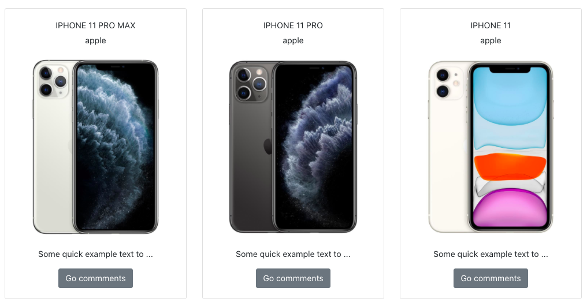
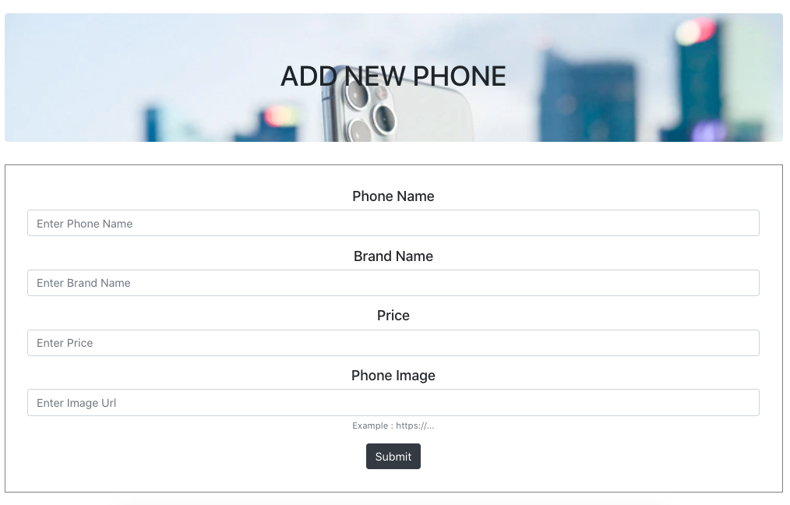

# React & Redux with Phone Comments Application 

Response & redux; I developed with. An application where you can access comments by listing the phones.

The purpose of this application is that users can access clean, accurate and understandable comments about the phone.

To present the comments obtained from various e-commerce sites using python (scrapy) technology and the comments we have classified using python (pandas) technology to users through this application.

# REST API 

https://5ea5689e2d86f00016b45bf7.mockapi.io/phones/

https://5ea5689e2d86f00016b45bf7.mockapi.io/comments/

## Live Link of the Project

[https://ekremtas.github.io/react-phone-comment-app/](https://ekremtas.github.io/react-phone-comment-app/)

## Libraries I Use
[React](https://www.npmjs.com/package/react)

[Redux](https://www.npmjs.com/package/redux)

[react-redux](https://www.npmjs.com/package/react-redux)

[react-router-dom](https://www.npmjs.com/package/react-router-dom)

[redux-thunk](https://www.npmjs.com/package/redux-thunk)

[Axios](https://www.npmjs.com/package/axios)

[Formik](https://jaredpalmer.com/formik/docs/overview)

[Yup](https://github.com/jquense/yup)

[Styled-components](https://www.styled-components.com/)

[reactstrap](https://www.npmjs.com/package/reactstrap)

## Run The Project
```
$ yarn install
```
After installing packages with

```
$ yarn start
```
You can run the project with.

# Sample Picture from the Project

Homepage screenshot


Phones page screenshot



AddPhone page screenshot



